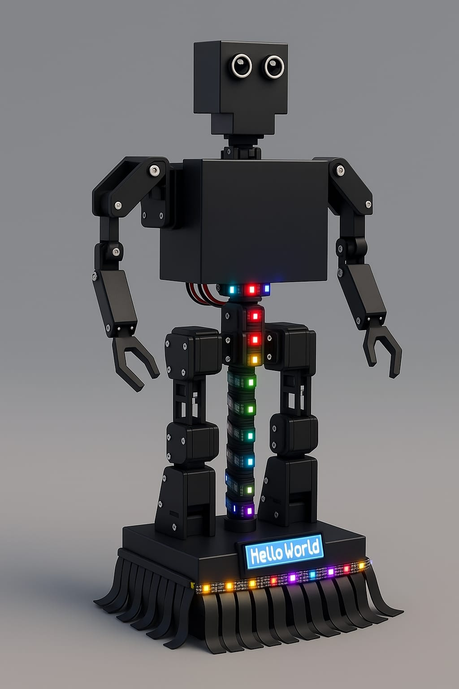
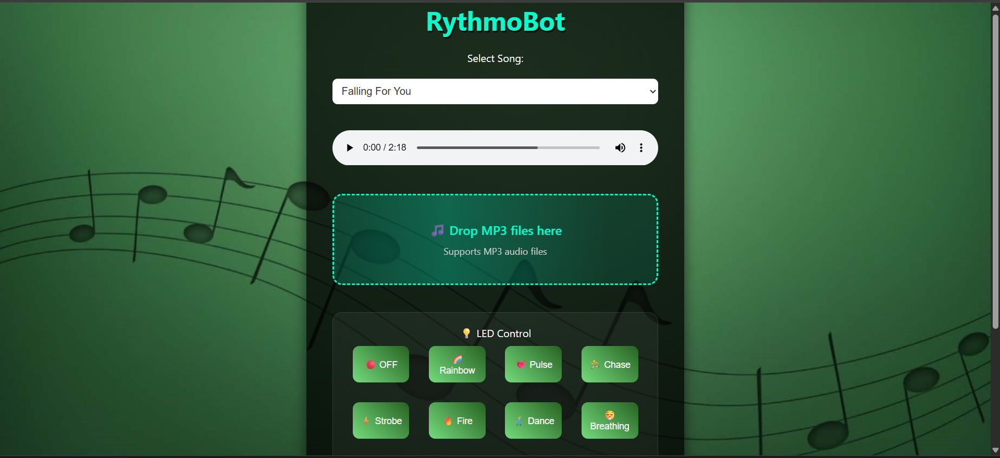
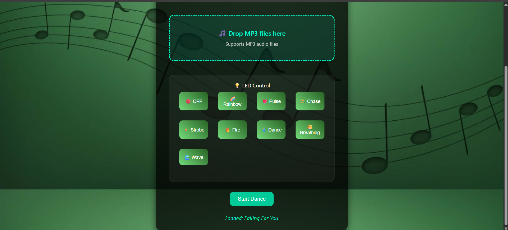

# RythmoBot - Dancing Robot Project



An interactive dancing robot controlled via web interface, featuring synchronized LED strips, sound sensors, obstacle detection, and choreographed dance moves to various songs.

## Project Structure

```
dancing-robot-project/
├── arduino/
│   ├── RythmoBot.ino              # Main Arduino code
│   ├── alone.h                    # "Alone" dance choreography
│   ├── constants.h                # Project constants and definitions
│   ├── faded.h                    # "Faded" dance choreography
│   ├── fallingforyou.h           # "Falling for you" dance choreography
│   ├── neural.h                   # "Mastie Mashup" dance choreography
│   ├── other.h                    # "Other" dance choreography
│   └── stereo.h                   # "Stereo Love" dance choreography
├── Web_App[1]/Web_App
│   ├── index.html                 # Main web interface
│   ├── style.css                  # Web styling
│   ├── script.js                  # Web JavaScript functionality
│   └── public/                    # Assets folder
│       ├── robot.gif              # Robot animation
│       ├── bg-dance.jpg           # Background image
│       └── songs/                 # Music files
│           ├── song1.mp3          # Falling For You
│           ├── song2.mp3          # Stereo Love
│           ├── song3.mp3          # Alone
│           ├── song4.mp3          # Mastie Mashup
│           ├── song5.mp3          # Alone-Marshmello
│           └── song6.mp3          # Faded
├── 
│   ├── blockdiagramnew.drawio.png    # Hardware assembly guide
│   ├── schematic-diagram.png         # Circuit connections
│   └── final_report_Rythmobot.pdf    # final report
├── .vscode
└── README.md                      # This file
```

## Features

- **Multi-Song Choreography**: Synchronized dance moves for 6 different songs
- **Web Interface**: Control robot remotely via WiFi
- **LED Light Shows**: 13 different LED patterns synchronized with dancing
- **Sound Detection**: Clap-to-dance functionality with sound sensor
- **Obstacle Avoidance**: Ultrasonic sensor prevents collisions
- **Speed Control**: Adjustable movement speed via web interface
- **Real-time Control**: Ultra-fast WebSocket communication
- **File Upload**: Upload custom MP3 files through web interface

## Hardware Requirements

### Main Components
- **ESP32 Development Board**
- **PCA9685 16-Channel PWM Driver** (I2C: 0x40)
- **LCD Display 16x2** (I2C: 0x27)
- **13 Servo Motors** (for arms and legs)
- **4 DC Motors** (for base movement)
- **Motor Driver Board** (L298N or similar)
- **WS2812B LED Strips** (60 LEDs)
- **HC-SR04 Ultrasonic Sensor**
- **Sound Sensor Module**
- **Buzzer**

### Pin Connections
```
Motor Driver:
IN1 → Pin 12    |  ENA → Pin 13 (PWM)
IN2 → Pin 14    |  ENB → Pin 25 (PWM)
IN3 → Pin 27    |
IN4 → Pin 26    |

Sensors:
Buzzer → Pin 18
Ultrasonic Trig → Pin 33
Ultrasonic Echo → Pin 32
Sound Sensor → Pin 34
LED Strip → Pin 2

I2C (SDA/SCL):
PCA9685 PWM Driver → 0x40
LCD Display → 0x27
```

## Getting Started

### 1. Hardware Setup
1. Assemble the robot chassis with 4-wheel base
2. Mount servo motors for arm and leg movements
3. Connect all components according to the wiring diagram
4. Install LED strips on the robot frame

### 2. Arduino Setup
1. Install required libraries in Arduino IDE:
   ```
   - WiFi (ESP32)
   - WebSocketsServer
   - Wire
   - Adafruit_PWMServoDriver
   - LiquidCrystal_I2C
   - FastLED
   ```

2. Update WiFi credentials in `RythmoBot.ino`:
   ```cpp
   const char* ssid = "YOUR_WIFI_NAME";
   const char* password = "YOUR_PASSWORD";
   ```

3. Upload the code to ESP32

  


### 3. Web Interface Setup
1. Host the web files on a local server or ESP32
2. Access the interface via ESP32's IP address
3. The IP will be displayed on the robot's LCD screen

### 4. Usage
1. Power on the robot
2. Wait for WiFi connection (check LCD for IP address)
3. Open web browser and navigate to the displayed IP
4. Select a song and click "Start Dance"
5. Use LED controls for different light patterns
6. Clap to trigger special dance moves!

## Supported Songs & Dance Moves

| Song | Choreography File | Steps |
|------|------------------|-------|
| Falling For You | `fallingforyou.h` | 26 coordinated moves |
| Stereo Love | `stereo.h` | Dynamic dance sequence |
| Faded | `faded.h` | Synchronized choreography |
| Alone | `alone.h` | Expressive movements |
| Mastie Mashup | `neural.h` | Complex routine |
| Other | `other.h` | General dance moves |

## Web Controls

### Music Controls
- Song selection dropdown
- Play/Pause/Stop buttons
- File upload for custom MP3s
- Volume control

### LED Patterns
- OFF - Turn off all LEDs
- Rainbow - Cycling rainbow effect
- Pulse - Breathing effect
- Chase - Moving light chase
- Strobe - Flashing strobe
- Fire - Fire simulation
- Dance - Synchronized with music
- Breathing - Gentle breathing effect
- Wave - Wave pattern

### Robot Controls
- Speed adjustment (0-255)
- Emergency stop
- Pause/Resume functionality

## Technical Features

### Ultra-Fast Response System
- WebSocket communication for real-time control
- Non-blocking servo movements
- Immediate pause/stop functionality
- Optimized WiFi settings for minimal latency

### Safety Features
- Obstacle detection with ultrasonic sensor
- Emergency stop capabilities
- Motor speed limiting
- Collision avoidance

### Audio Features
- Multi-tone buzzer feedback
- Startup, pause, stop, and dance sound effects
- Step-synchronized audio cues
- WiFi connection confirmation sounds

## Customization

### Adding New Songs
1. Create a new `.h` file in the arduino folder
2. Define your choreography sequence
3. Add the song option in `index.html`
4. Include the header in `RythmoBot.ino`

### Modifying LED Patterns
Edit the LED functions in the main Arduino code:
- `ledRainbow()`, `ledPulse()`, `ledChase()`, etc.
- Adjust timing with `ledUpdateInterval`
- Create custom color schemes

### Adjusting Dance Moves
Modify the servo positions in choreography files:
```cpp
smoothMove(channel, angle, delay);
pwmWriteAngle(channel, angle);
```

## API Documentation

### WebSocket Commands
```javascript
// Song control
ws.send("song:Song Name");
ws.send("pause");
ws.send("stop");
ws.send("resume");

// Dance steps (1-26)
ws.send("15");

// Speed control (0-255)
ws.send("speed:150");

// LED control
ws.send("led:rainbow");
ws.send("brightness:200");
```

## Team Collaboration

This project supports team collaboration through Git:

1. **Clone the repository**:
   ```bash
   git clone https://github.com/your-username/dancing-robot-project.git
   ```

2. **Create feature branches**:
   ```bash
   git checkout -b feature/new-dance-moves
   ```

3. **Commit your changes**:
   ```bash
   git add .
   git commit -m "Add new dance choreography for Song X"
   ```

4. **Push and create pull request**:
   ```bash
   git push origin feature/new-dance-moves
   ```

## Troubleshooting

### Common Issues
- **WiFi Connection Failed**: Check SSID and password
- **Servo Not Moving**: Verify wiring and power supply
- **Web Interface Not Loading**: Confirm IP address on LCD
- **LED Strip Not Working**: Check data pin connection (Pin 2)
- **Sound Sensor Too Sensitive**: Adjust `clapDebounceDelay`

### Debug Mode
Enable serial debugging by opening Serial Monitor at 115200 baud rate.

## License

This project is licensed under the MIT License - see the [LICENSE](LICENSE) file for details.


## Resources

- [ESP32 Documentation](https://docs.espressif.com/projects/esp32/en/latest/)
- [PCA9685 Servo Driver Guide](https://learn.adafruit.com/16-channel-pwm-servo-driver)
- [FastLED Library Documentation](https://fastled.io/)

---

Made with ❤️ by CircuitBuilders | RythmoBot Dancing Robot
